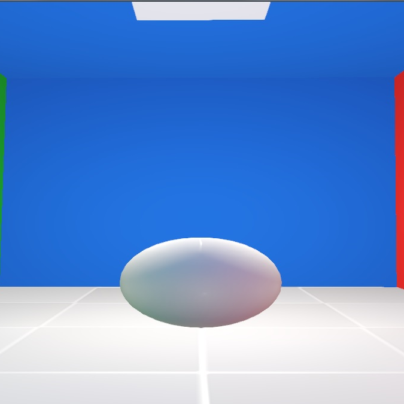

# i0rTech
A 3D engine, built with OpenGL.

## Features
- Deferred Tiled Shading
- Physically Based Rendering
- Dynamic Environment Mapping
- Blender Export Addon
- Input handler
- Debug logging console
- Task Manager for multithreading
- FXAA
- Shaders / Textures hotswapping
- Debug Menu
- Mouse picking (using raycasting)
- Editor view
- Cascaded Shadow Mapping with PCF

## Build Requirements
- CMake (>= 2.8)

## Default keymapping
- ESC - Exit the engine 
- F   - Change Current Mode (Game/Editor) 
- WASD (or ZQSD) - Move the camera (Game mode) 
- Mouse Scroll - Camera Zoom (Editor mode) 
- Right Mouse Button (Held) - Camera 'Focus' Zoom (Editor mode) 
- Left Mouse Button (Held) - Pick and move the item being hovered 

### The following keys are only available in a debug build: 
- HOME - Open the debug menu 
- PAGEUP/PAGEDOWN - Navigate in the debug menu 
- END - Execute the selected item (trigger a callback, enter in a submenu, ...) 
- INSERT/DELETE - Increment/Decrement the selected variable (if the selected item is a bool, float, int, ...) 
